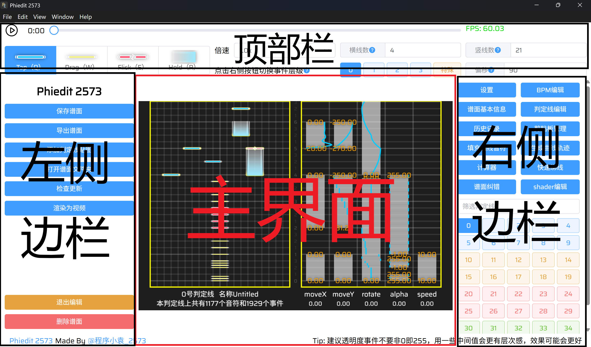

# Phiedit 2573 v0.2.2

## 项目介绍

Phiedit 2573 是我（bilibili 账号 [@程序小袁_2573](https://space.bilibili.com/522248560)）基于 Vue-Electron 框架开发的一款 Phigros 谱面编辑器、渲染器二合一的软件，编程语言为 Typescript。
本软件从 2024 年的暑假开始开发，设计参考了 [@cmdysj](https://space.bilibili.com/252635690) 开发的制谱软件 Re:PhiEdit（以下简称 RPE）。

## 版权声明

本项目所有源代码均采用 [MIT](https://opensource.org/licenses/MIT) 协议授权，详细信息请查看根目录的 [LICENSE](LICENSE) 文件。

## 使用方法

1. 下载最新的 release
2. 运行 exe 安装包
3. 打开软件
4. 开始使用

### 基本操作

打开软件并进入谱面后，会显示下面的编辑器界面。编辑器界面包括主界面、左侧边栏、右侧边栏、顶部栏四部分。

| 操作名称                 | 操作方法                                                                                                               |
| ------------------------ | ---------------------------------------------------------------------------------------------------------------------- |
| 放置 Tap/Drag/Flick 音符 | 按 Q/W/E 键，并在主界面左半部分**右键**放置                                                                            |
| 放置 Hold 音符           | 按 R 键，并在主界面左半部分**按住右键并拖动**                                                                          |
| 放置事件                 | 在主界面右半部分**按住右键并拖动**                                                                                     |
| 拖拽 Tap/Drag/Flick 音符 | 直接用鼠标左键拖拽即可                                                                                                 |
| 拖拽 Hold 音符或事件     | 直接用鼠标**靠近其头部或尾部**，左键拖拽即可                                                                           |
| 选中单个音符或事件       | 用鼠标左键直接点击该音符或事件                                                                                         |
| 选中多个音符或事件       | 在主界面的**空白处**按住鼠标**左键**，拖拽框选                                                                         |
| 修改音符或事件的属性     | 选中音符或事件，并在**左侧边栏**内进行操作                                                                             |
| 设置 BPM                 | 点击**右侧边栏**的“BPM 编辑”，并修改 BPM 的数值                                                                        |
| 切换判定线               | 点击**右侧边栏**中的数字按钮，也可使用快捷键 **A、D** 或者**左方括号、右方括号**切换到上一条或下一条判定线             |
| 切换事件层级             | 点击**顶部栏**的事件层级按钮                                                                                           |
| 播放/暂停                | 按空格键                                                                                                               |
| 预览谱面                 | 按 **I** 键                                                                                                            |
| 预览一小段谱面           | 按 **T** 或 **U** 键，并在你想停止预览时松开此键，T 键松开后进度条会回到原位置，U 键松开后进度条会留在预览结束时的位置 |
| 剪切、复制、粘贴         | 点击**右侧边栏**的“剪贴板管理”并点击相应的按钮，或者使用快捷键 **Ctrl+X、Ctrl+C、Ctrl+V**                              |
| 撤销、重做               | 点击**右侧边栏**的“历史记录”并点击相应的按钮，或者使用快捷键 **Ctrl+Z、Ctrl+Y**                                        |
| 删除音符/事件            | 选中音符或事件后按 Delete 键                                                                                           |
| 编辑曲名/难度等信息      | 点击**右侧边栏**的“谱面基本信息”并进行编辑                                                                             |
| 保存谱面                 | 点击**左侧边栏**的“保存谱面”按钮，也可使用快捷键 Ctrl+S                                                                |
| 导出谱面                 | 点击**左侧边栏**的“导出谱面”按钮，选择要导出到的文件夹，点击保存                                                       |
| 试玩谱面                 | 点击**左侧边栏**的“试玩”按钮，然后用键盘游玩                                                                           |

### 高级操作

待补充。

### 常见问题及解决办法

Q:
> 谱面和音乐对不上拍子怎么办？

A:
> 确保你设置的 BPM 正确。
> 如果你不知道音乐的 BPM ，你可以通过一些免费的工具（例如[这个网站](https://vocalremover.org/zh/key-bpm-finder)） 测定。
>
> 另外，如果偏移设置的不对，也会导致对不上的问题。
>
> 请进入界面右侧的“BPM 编辑”设置正确的 BPM，并在顶部栏右侧的“偏移”输入框中设置正确的偏移值（单位为毫秒）。

Q:
> 判定线消失了怎么办？

A:
> 确保你当前判定线上，alpha 事件的值大于 0。
>
> 另外，请检查特殊事件层级，因为值为 0 的 scaleX、scaleY 事件和值为空字符串的 text 事件都会让判定线无法显示。

Q:
> 为什么我设置了 moveX 和 moveY 事件，但是事件的值与判定线实际上显示的位置不同？

A:
> 第一个可能的原因是这条判定线**被设置了父线**。有父线的判定线会**以父线为坐标系**，而非以屏幕为坐标系。
>
> 第二个可能的原因是这条判定线**被绑定了 UI**。绑定了 UI 的判定线实际上显示的坐标等于判定线上 moveX 和 moveY 事件所设置的坐标**加上 UI 原坐标**（UI 原坐标位于源代码 [constants.ts](src/constants.ts#L102) 中，可查看）。
>
> 第三个可能的原因是这条判定线**使用了多个事件层级**。请检查其他的事件层级，看看是否有值不为 0 的事件。值不为 0 的事件会**累加到**判定线的坐标上。在你设置这个层级的事件之前，在其他层级上放置值为 0 的 moveX 和 moveY 事件。

## 一些未修复的 bug 和未实现的功能

1. 目前只能在电脑端游玩，我打算以后给这个软件增加一个移动端，可以和电脑端互传谱面文件，也可以在上面游玩谱面
    <!-- （但是我更希望的是让 Phira 和 RPE 添加这个功能） -->
2. Hold 的打击特效频率是写死在程序里的，不能跟随 BPM 的变化而变化
    <!-- （只知道 Hold 的打击特效频率和 BPM 有关，但不知道是什么关系） -->
3. 有很多不支持的属性，因为不清楚这些属性的含义
    <!-- （不支持 Controls，bpmfactor，linkgroup 等属性） -->
4. 不支持 paint 事件，因为 RPE 已经弃用该功能
    <!-- （其实另一个原因是我不知道 paint 事件的具体逻辑是什么）-->
5. 目前该项目还存在很多未发现的 bug，如果你发现了 bug 或者有好的建议，请在 Issue 中提出。

## 参与开发

想为本项目做贡献？请阅读[贡献指南](CONTRIBUTING.md)并从下方任务列表开始！
